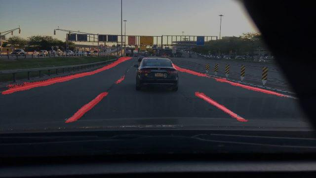

# Lane-Detection
Automatic detection of lane marks can be solved by the deep learning based semantic segmentation algorithms.Semantic segmentation achieves fine-grained inference by labels for every pixel, so that each pixel is labelled with the class of its enclosing object or region. So using semantic segmemtation, the lane marks in an image can be labelled with a specific color which is assigned to the class of the lane marks. The net used is based on the fully convolutional neural net described in the paper [Fully Convolutional Networks for Semantic Segmentation](https://arxiv.org/pdf/1605.06211.pdf). The code is based on the implementation of [FCN Implementation] (https://github.com/sagieppel/Fully-convolutional-neural-network-FCN-for-semantic-segmentation-Tensorflow-implementation).

## Development Setup
This network was run with Python 3.6  Anaconda package and Tensorflow > 1.1. The training was done using 8 GB Nvidia Quadro P4000, on Windows 10.

## Training
#### Data Preparation
Used the preprocessing/check_dataset.py for checking the jpeg images and labels.Manually removed the corrupt images from the data set.

For further preprocessing each image is checked manually for improper labelling and removed from the dataset.

Used the preprocessing/preprocessing.py for downsampling of images to 640 x360 size to fit the training data on available gpu. Before down sampling it will also add gaussian blur to remove noise.This will convert the label images to 8-bit png images with same name as the corresponding images.

The label images use 255 to represent the lane field and 0 for the background.

Finally divided the data set into training,validation and test set. 10% of the dataset is used for validation set, 5% for test set and rest for training. Each training, validation and test folder should have JPEGImages and Labels folder.

#### Training Model
For training use the TRAIN.py
1) Set folder path of the training images in TRAIN_Image_Dir
2) Set folder path for the ground truth labels in TRAIN_Label_Dir
3)Download a pretrained [vgg16] (ftp://mi.eng.cam.ac.uk/pub/mttt2/models/vgg16.npy) model and put it in the Model folder
4) Set the number of class in NUM_CLASS which is 2 in this case
5) Also set the batchsize to 4.

For Inference use the Inference.py
1) Make sure that the train model is logs_dir
2) Set the Image_Dir to the test image folder
3) Set the number of class in NUM_CLASSES

#### Predicted Result
The predicted result after 20000 iterations:

## Future Work
 1) Run for more number of iterations
 2) Increase the batch size which is currently limited by available gpu memory size. 

